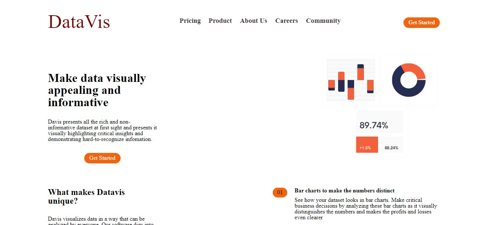

# Project-Portfolio-01

## Description
A web based full stack software application that visualizes data on the road conditions in Ghana in the form of bar and pie charts. The data was analyzed and the necessary information needed to make a pictorial representation of the data was displayed in an intuitive manner, one that would be understood by everyone. The technologies and languages used for building this application includes D3, bootstrap, js, jquery, python, flask, mysql, linux. Find the link to the deployed front-end application [here](https://brian-machiestay.github.io/Project-portfolio-01/)

## Installation
This is a web based application that needs no traditional installation. Rather, you just launch the application from within the main folder by double clicking on the index.html file which launches into the landing page. From this landing page, you can then have access to the other pages by clicking on their respective buttons from the navigation bar.

## User Story
* I want to visualize road conditions in Ghana both the number and percentages.

* I want to see representative bar and pie charts, if a user hovers on a bar, it should be selected and show the average score of roads in that region as well as the highest road score.

* Getting such features on the website will guide and help me as a user making decisions and self as a input figure for subsequent research.  

## Acceptance Criteria
* It is done when the Data Visualization (Landing Page) is linked to the Chart pages (Ghana road, pie).

* It is done when the user hovers around a bar or a pie chart and brings up the average score of roads and the highest road score and other relevant statistics.
* It is done when there is pie chart, bar chart, line and scatterd graph all embeded within the application and with a click on each, it fetches data out for the user to see.

## Credits
We are grateful for the support coming from our Mentors of the ALX software engineering fraternity and our peers of Cohort 6 for their help in diverse ways.
## Licence
Please refer to the MIT licence in the repository

## Landing Page Link
* https://brian-machiestay.github.io/Project-portfolio-01

## Link to Github Repository
* https://github.com/Brian-Machiestay/Project-portfolio-01

## Screenshots
* Landing page 

* Charts Page(Bars)

* Pie:

## Contributors:

* Brian Machiestay-Dzregah Elorm
* Williams Osei Prempeh
* Damien Nsoh Ayine
